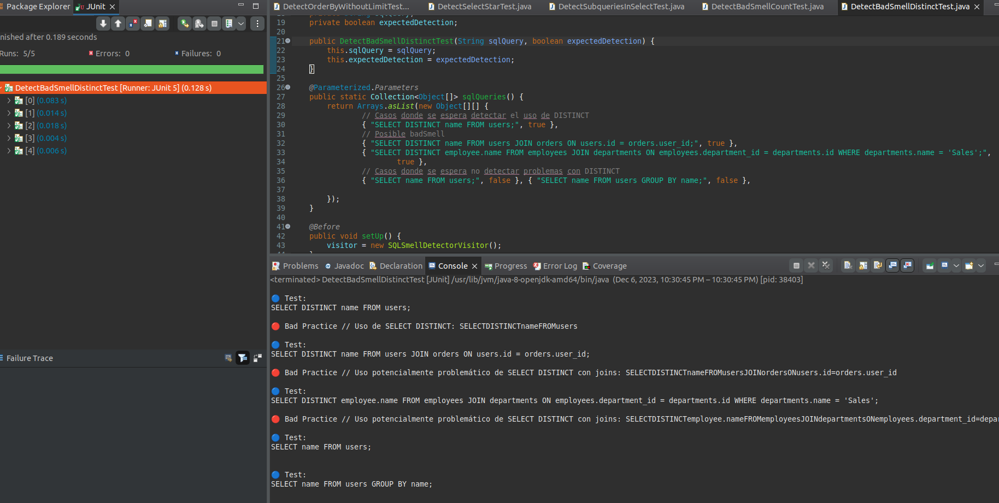

# Test en eclipse

Se muestran los resultados de los test de cada class test.
En cada objeto .json se representa en primer lugar la query, y en segundo lugar un valor boolean (true/false), si es true significa que se debe detectar el badsmell, caso contrario false.


# DetectSubqueriesInSelectTest


```json
// Casos de prueba con expectativas de bad smell
{ "SELECT name FROM users WHERE id IN (SELECT user_id FROM orders);", true },
{ "SELECT department_id, COUNT(*) FROM employees GROUP BY department_id HAVING COUNT(*) > (SELECT COUNT(*) / 10 FROM employees);",
		true },
{ "SELECT name, (SELECT MAX(salary) FROM employees WHERE department = users.department) AS max_salary FROM users;",
		true },
{ "SELECT name FROM users WHERE EXISTS (SELECT * FROM orders WHERE orders.user_id = users.id);", true },
{ "SELECT name, (SELECT AVG(salary) FROM employees WHERE department = users.department), (SELECT COUNT(*) FROM orders WHERE user_id = users.id) FROM users;",
		true },
{ "SELECT users.name, COUNT(orders.id) AS order_count FROM users JOIN orders ON users.id = orders.user_id GROUP BY users.id;",
		false },
{ "SELECT users.name, AVG(orders.price) AS avg_order_price FROM users JOIN orders ON users.id = orders.user_id GROUP BY users.id;",
		false },
{ "SELECT users.name, COUNT(orders.id) AS order_count, SUM(orders.amount) AS total_spent FROM users JOIN orders ON users.id = orders.user_id GROUP BY users.id;",
		false },
{ "SELECT users.name FROM users JOIN orders ON users.id = orders.user_id WHERE orders.amount > 1000 GROUP BY users.id;",
		false },
// Casos de prueba con expectativas sin bad smell
{ "SELECT name, COUNT(order_id) FROM orders GROUP BY user_id;", false },
{ "SELECT department_id, COUNT(*) FROM employees GROUP BY department_id HAVING COUNT(*) > 5;", false },
{ "SELECT name, salary FROM users;", false }, { "SELECT name FROM users WHERE id > 1000;", false },
{ "SELECT name FROM users;", false },
{ "SELECT users.name, COUNT(orders.id) AS order_count FROM users JOIN orders ON users.id = orders.user_id GROUP BY users.id;",
		false },
{ "SELECT users.name FROM users JOIN orders ON users.id = orders.user_id WHERE orders.amount > 1000 GROUP BY users.id;",
		false } });

```


## Print de consola

```
🔵 Test:
SELECT name FROM users WHERE id IN (SELECT user_id FROM orders);

🔴 Bad Practice // Detectado uso de subconsulta en SELECT:
SELECTuser_idFROMorders

🔵 Test:
SELECT department_id, COUNT(*) FROM employees GROUP BY department_id HAVING COUNT(*) > (SELECT COUNT(*) / 10 FROM employees);

🔴 Bad Practice // Detectado uso de subconsulta en SELECT:
SELECTCOUNT(*)/10FROMemployees

🔵 Test:
SELECT name, (SELECT MAX(salary) FROM employees WHERE department = users.department) AS max_salary FROM users;

🔴 Bad Practice // Detectado uso de subconsulta en SELECT:
SELECTMAX(salary)FROMemployeesWHEREdepartment=users.department

🔵 Test:
SELECT name FROM users WHERE EXISTS (SELECT * FROM orders WHERE orders.user_id = users.id);

🔴 Bad Practice // Detectado uso de subconsulta en SELECT:
SELECT*FROMordersWHEREorders.user_id=users.id

🔵 Test:
SELECT name, (SELECT AVG(salary) FROM employees WHERE department = users.department), (SELECT COUNT(*) FROM orders WHERE user_id = users.id) FROM users;

🔴 Bad Practice // Detectado uso de subconsulta en SELECT:
SELECTAVG(salary)FROMemployeesWHEREdepartment=users.department

🔵 Test:
SELECT users.name, COUNT(orders.id) AS order_count FROM users JOIN orders ON users.id = orders.user_id GROUP BY users.id;


🔵 Test:
SELECT users.name, AVG(orders.price) AS avg_order_price FROM users JOIN orders ON users.id = orders.user_id GROUP BY users.id;


🔵 Test:
SELECT users.name, COUNT(orders.id) AS order_count, SUM(orders.amount) AS total_spent FROM users JOIN orders ON users.id = orders.user_id GROUP BY users.id;


🔵 Test:
SELECT users.name FROM users JOIN orders ON users.id = orders.user_id WHERE orders.amount > 1000 GROUP BY users.id;


🔵 Test:
SELECT name, COUNT(order_id) FROM orders GROUP BY user_id;


🔵 Test:
SELECT department_id, COUNT(*) FROM employees GROUP BY department_id HAVING COUNT(*) > 5;


🔵 Test:
SELECT name, salary FROM users;


🔵 Test:
SELECT name FROM users WHERE id > 1000;


🔵 Test:
SELECT name FROM users;


🔵 Test:
SELECT users.name, COUNT(orders.id) AS order_count FROM users JOIN orders ON users.id = orders.user_id GROUP BY users.id;


🔵 Test:
SELECT users.name FROM users JOIN orders ON users.id = orders.user_id WHERE orders.amount > 1000 GROUP BY users.id;


```


# DetectBadSmellCountTest

```json
 { "SELECT name, (SELECT COUNT(*) FROM orders WHERE user_id = users.id) AS order_count FROM users;", true },
 { "SELECT COUNT(*) FROM users;", true },
 { "SELECT COUNT(ID) FROM users;", false },
```


```

🔵 Test:
SELECT name, (SELECT COUNT(*) FROM orders WHERE user_id = users.id) AS order_count FROM users;

🔴 Bad Practice // Uso ineficiente de COUNT: COUNT(*)

🔵 Test:
SELECT COUNT(*) FROM users;

🔴 Bad Practice // Uso ineficiente de COUNT: COUNT(*)

🔵 Test:
SELECT COUNT(ID) FROM users;
```

# DetectBadSmellDistinctTest

```json
// Casos donde se espera detectar el uso de DISTINCT
{ "SELECT DISTINCT name FROM users;", true },
// Posible badSmell
{ "SELECT DISTINCT name FROM users JOIN orders ON users.id = orders.user_id;", true },
{ "SELECT DISTINCT employee.name FROM employees JOIN departments ON employees.department_id = departments.id WHERE departments.name = 'Sales';",
		true },
// Casos donde se espera no detectar problemas con DISTINCT
{ "SELECT name FROM users;", false }, { "SELECT name FROM users GROUP BY name;", false },
```


```🔵 Test:
SELECT DISTINCT name FROM users;

🔴 Bad Practice // Uso de SELECT DISTINCT: SELECTDISTINCTnameFROMusers

🔵 Test:
SELECT DISTINCT name FROM users JOIN orders ON users.id = orders.user_id;

🔴 Bad Practice // Uso potencialmente problemático de SELECT DISTINCT con joins: SELECTDISTINCTnameFROMusersJOINordersONusers.id=orders.user_id

🔵 Test:
SELECT DISTINCT employee.name FROM employees JOIN departments ON employees.department_id = departments.id WHERE departments.name = 'Sales';

🔴 Bad Practice // Uso potencialmente problemático de SELECT DISTINCT con joins: SELECTDISTINCTemployee.nameFROMemployeesJOINdepartmentsONemployees.department_id=departments.idWHEREdepartments.name='Sales'

🔵 Test:
SELECT name FROM users;


🔵 Test:
SELECT name FROM users GROUP BY name;
```

# DetectBadSmellOrInTest

```json
{ "SELECT name, price FROM products WHERE category = 'fruit' OR category = 'dairy';", true },
{ "SELECT name, price FROM products WHERE category = 'fruit' OR ZipCode = '1900';", false },
{ "SELECT name, price FROM products WHERE category IN ('fruit', 'dairy') OR ZipCode IN (1900, 2000);",
		false },
```


```
🔵 Test:
SELECT name, price FROM products WHERE category = 'fruit' OR category = 'dairy';

🔴 Bad Practice // Detectado uso potencialmente ineficiente de OR que podría ser reemplazado por IN: category='fruit'ORcategory='dairy'

🔵 Test:
SELECT name, price FROM products WHERE category = 'fruit' OR ZipCode = '1900';


🔵 Test:
SELECT name, price FROM products WHERE category IN ('fruit', 'dairy') OR ZipCode IN (1900, 2000);

```

# DetectLikeWithLeadingWildcardTest

```json
// Casos donde se espera detectar LIKE con comodín líder
{ "SELECT * FROM products WHERE name LIKE '%apple%';", true },
// Casos donde no se espera detectar LIKE con comodín líder
{ "SELECT * FROM products WHERE name LIKE 'apple%';", false },
{ "SELECT * FROM products WHERE name LIKE 'appl%e';", false },
```


```
🔵 Test:
SELECT * FROM products WHERE name LIKE '%apple%';

🔴 Bad Practice // Detectado uso de LIKE con comodín líder: nameLIKE'%apple%'

🔵 Test:
SELECT * FROM products WHERE name LIKE 'apple%';


🔵 Test:
SELECT * FROM products WHERE name LIKE 'appl%e';

```

# DetectOrderByWithoutLimitTest

```json
// Casos donde se espera detectar el uso de ORDER BY sin LIMIT
{ "SELECT name FROM users ORDER BY name;", true },
{ "SELECT id, date FROM orders ORDER BY date DESC;", true },
{ "SELECT product_name FROM products ORDER BY price ASC;", true },
// Casos donde no se espera detectar el problema
{ "SELECT name FROM users;", false }, { "SELECT id, date FROM orders;", false },
{ "SELECT product_name FROM products WHERE price > 100;", false },
{ "SELECT name FROM users ORDER BY name LIMIT 10;", false },
{ "SELECT id FROM orders ORDER BY date DESC LIMIT 5;", false },
{ "SELECT price, name, category FROM products ORDER BY price ASC LIMIT 20;", false },
```


```
🔵 Test:
SELECT name FROM users ORDER BY name;

🔴 Bad Practice // Uso de ORDER BY sin LIMIT.

🔵 Test:
SELECT id, date FROM orders ORDER BY date DESC;

🔴 Bad Practice // Uso de ORDER BY sin LIMIT.

🔵 Test:
SELECT product_name FROM products ORDER BY price ASC;

🔴 Bad Practice // Uso de ORDER BY sin LIMIT.

🔵 Test:
SELECT name FROM users;


🔵 Test:
SELECT id, date FROM orders;


🔵 Test:
SELECT product_name FROM products WHERE price > 100;


🔵 Test:
SELECT name FROM users ORDER BY name LIMIT 10;


🔵 Test:
SELECT id FROM orders ORDER BY date DESC LIMIT 5;


🔵 Test:
SELECT price, name, category FROM products ORDER BY price ASC LIMIT 20;

```

# DetectSelectStarTest

```json
{ "SELECT * FROM users;", true },
{ "SELECT *, name FROM employees;", true },
// Casos donde no se espera detectar SELECT *
{ "SELECT name FROM users;", false },
{ "SELECT id, name FROM employees;", false },
{ "SELECT u.name FROM users u;", false },
```
